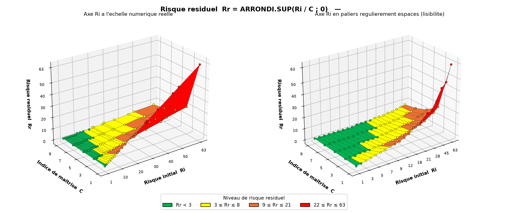

# Residual Risk 3D Surface

Two Python scripts that turn a risk matrix into a 3D surface of the residual risk

```
Rr = ROUNDUP(Ri / C, 0)
```

where `Ri` is the initial risk and `C` the control index.

The colours are not hard coded: they are read directly from the Excel workbook, including
the conditional formatting rules of the residual risk column and the theme colours stored
in `xl/theme/`. Changing the thresholds in Excel changes the figure, with no code edit.




## What it does

* Reads the `(Ri, C)` pairs from a worksheet and recomputes `Rr` for every pair.
* Extracts the conditional formatting rules (`lessThan`, `greaterThan`, `between`) and
  resolves their fill colours, theme references included.
* Colours each facet of the surface with the worst of its four corners, so a cell never
  looks safer than it is.
* Draws the same data twice: once with the true numeric scale of `Ri`, once with evenly
  spaced steps, because the real scale is irregular and compresses the low values.
* Produces either a PNG (Matplotlib) or a standalone interactive HTML file (Plotly) that
  works offline, with rotation, zoom, hover values and a clickable legend.

## Installation

```bash
pip install -r requirements.txt
```

## Usage

Static figure:

```bash
python src/residual_risk_surface.py --workbook path/to/workbook.xlsx --sheet Sheet1 --output output/residual_risk_3d.png
```

Interactive figure:

```bash
python src/residual_risk_interactive.py --workbook path/to/workbook.xlsx --sheet Sheet1 --output output/residual_risk_3d.html --open
```

Run either script without `--workbook` to use the built in sample grid and default
thresholds, which is handy for a quick look without any Excel file.

Expected worksheet layout: column B holds `Ri`, column C holds `C`, column D holds `Rr`
and carries the conditional formatting rules. The first row is treated as a header.
Use `--column` if the residual risk sits in another column.

## Files

| File | Role |
| --- | --- |
| `src/risk_data.py` | Workbook reading, theme colours, conditional formatting rules, grid building |
| `src/residual_risk_surface.py` | Static Matplotlib figure, two views side by side |
| `src/residual_risk_interactive.py` | Interactive Plotly figure exported as a standalone HTML file |

---

# Surface 3D du risque residuel

Deux scripts Python qui transforment une matrice de risques en surface 3D du risque
residuel

```
Rr = ARRONDI.SUP(Ri / C ; 0)
```

ou `Ri` est le risque initial et `C` l'indice de maitrise.

Les couleurs ne sont pas ecrites en dur : elles sont lues directement dans le classeur
Excel, a la fois les regles de mise en forme conditionnelle de la colonne du risque
residuel et les couleurs de theme stockees dans `xl/theme/`. Modifier les seuils dans
Excel modifie la figure, sans toucher au code.

## Ce que font les scripts

* Lecture des couples `(Ri, C)` dans une feuille et recalcul de `Rr` pour chaque couple.
* Extraction des regles de mise en forme conditionnelle (`lessThan`, `greaterThan`,
  `between`) et resolution de leurs couleurs de remplissage, references de theme comprises.
* Coloration de chaque facette de la surface par le plus defavorable de ses quatre coins,
  pour qu'une case n'apparaisse jamais plus sure qu'elle ne l'est.
* Trace des memes donnees deux fois : une fois a l'echelle numerique reelle de `Ri`, une
  fois en paliers regulierement espaces, car l'echelle reelle est irreguliere et ecrase
  les faibles valeurs.
* Production soit d'un PNG (Matplotlib), soit d'un fichier HTML interactif autonome
  (Plotly) qui fonctionne hors ligne, avec rotation, zoom, valeurs au survol et legende
  cliquable.

## Installation

```bash
pip install -r requirements.txt
```

## Utilisation

Figure statique :

```bash
python src/residual_risk_surface.py --workbook chemin/vers/classeur.xlsx --sheet Feuil1 --output output/residual_risk_3d.png
```

Figure interactive :

```bash
python src/residual_risk_interactive.py --workbook chemin/vers/classeur.xlsx --sheet Feuil1 --output output/residual_risk_3d.html --open
```

Lances sans `--workbook`, les deux scripts utilisent une grille d'exemple et des seuils
par defaut, ce qui permet de voir le resultat sans aucun fichier Excel.

Structure de feuille attendue : la colonne B contient `Ri`, la colonne C contient `C`, la
colonne D contient `Rr` et porte les regles de mise en forme conditionnelle. La premiere
ligne est consideree comme un en tete. L'option `--column` permet d'indiquer une autre
colonne pour le risque residuel.

## Fichiers

| Fichier | Role |
| --- | --- |
| `src/risk_data.py` | Lecture du classeur, couleurs de theme, regles de mise en forme conditionnelle, construction de la grille |
| `src/residual_risk_surface.py` | Figure statique Matplotlib, deux vues cote a cote |
| `src/residual_risk_interactive.py` | Figure interactive Plotly exportee en HTML autonome |
